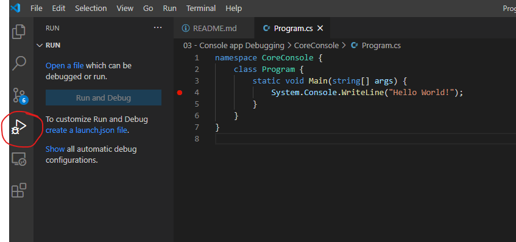
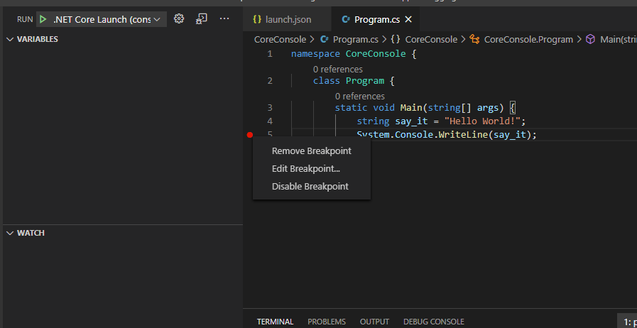
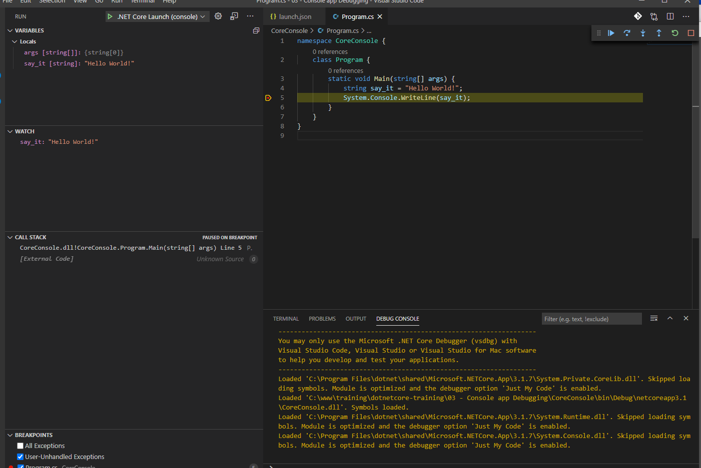

## Debugging in VSCODE

In order to DEBUG within VSCODE you'll need to have a `.vscode/launch.json` file. 

In order to create a launch.json file, open the folder where the SLN file is (`02 - Console app`) in VSCODE

1. open the RUN menu and click the "create a launch.json file." link in the left rail.

2. set a breakpoint in the code (screenshot from `03 - Console app`).

3. RUN and view the debug session

## Important parts to notice within the DEBUG window:

**LOCALS**: the list of variables available to you within the current line of code

**WATCH**: variables you want to watch across functions

**CALL STACK**: every line of code that has been executed through the current lifecycle of the request (or program execution).

**PLAY AND STEP CONTROLS**: basic controls for moving through the code.

