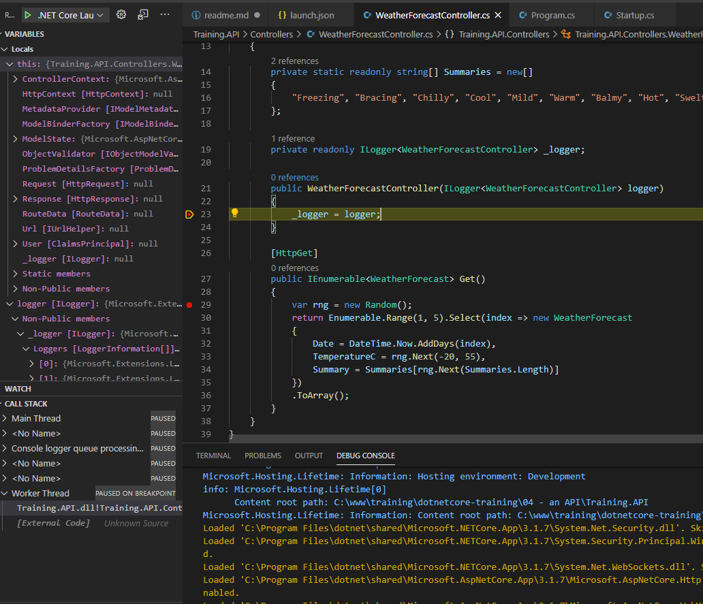

# Creating a new project

To see the list of things avialable to you in dotnet, start by typing `dotnet new` in a terminal window

```
Usage: new [options]

Options:
  -h, --help          Displays help for this command.
  -l, --list          Lists templates containing the specified name. If no name is specified, lists all templates.
  -n, --name          The name for the output being created. If no name is specified, the name of the current directory is used.
  -o, --output        Location to place the generated output.
  -i, --install       Installs a source or a template pack.
  -u, --uninstall     Uninstalls a source or a template pack.
  --nuget-source      Specifies a NuGet source to use during install.
  --type              Filters templates based on available types. Predefined values are "project", "item" or "other".
  --dry-run           Displays a summary of what would happen if the given command line were run if it would result in a template creation.
  --force             Forces content to be generated even if it would change existing files.
  -lang, --language   Filters templates based on language and specifies the language of the template to create.
  --update-check      Check the currently installed template packs for updates.
  --update-apply      Check the currently installed template packs for update, and install the updates.


Templates                                         Short Name               Language          Tags                                 
----------------------------------------------------------------------------------------------------------------------------------
Console Application                               console                  [C#], F#, VB      Common/Console                       
Class library                                     classlib                 [C#], F#, VB      Common/Library                       
WPF Application                                   wpf                      [C#]              Common/WPF                           
WPF Class library                                 wpflib                   [C#]              Common/WPF                           
WPF Custom Control Library                        wpfcustomcontrollib      [C#]              Common/WPF                           
WPF User Control Library                          wpfusercontrollib        [C#]              Common/WPF                           
Windows Forms (WinForms) Application              winforms                 [C#]              Common/WinForms                      
Windows Forms (WinForms) Class library            winformslib              [C#]              Common/WinForms                      
Worker Service                                    worker                   [C#]              Common/Worker/Web                    
Unit Test Project                                 mstest                   [C#], F#, VB      Test/MSTest                          
NUnit 3 Test Project                              nunit                    [C#], F#, VB      Test/NUnit                           
NUnit 3 Test Item                                 nunit-test               [C#], F#, VB      Test/NUnit                           
xUnit Test Project                                xunit                    [C#], F#, VB      Test/xUnit                           
Razor Component                                   razorcomponent           [C#]              Web/ASP.NET                          
Razor Page                                        page                     [C#]              Web/ASP.NET                          
MVC ViewImports                                   viewimports              [C#]              Web/ASP.NET                          
MVC ViewStart                                     viewstart                [C#]              Web/ASP.NET                          
Blazor Server App                                 blazorserver             [C#]              Web/Blazor                           
Blazor WebAssembly App                            blazorwasm               [C#]              Web/Blazor/WebAssembly               
ASP.NET Core Empty                                web                      [C#], F#          Web/Empty                            
ASP.NET Core Web App (Model-View-Controller)      mvc                      [C#], F#          Web/MVC                              
ASP.NET Core Web App                              webapp                   [C#]              Web/MVC/Razor Pages                  
ASP.NET Core with Angular                         angular                  [C#]              Web/MVC/SPA                          
ASP.NET Core with React.js                        react                    [C#]              Web/MVC/SPA                          
ASP.NET Core with React.js and Redux              reactredux               [C#]              Web/MVC/SPA                          
Razor Class Library                               razorclasslib            [C#]              Web/Razor/Library/Razor Class Library
ASP.NET Core Web API                              webapi                   [C#], F#          Web/WebAPI                           
ASP.NET Core gRPC Service                         grpc                     [C#]              Web/gRPC                             
dotnet gitignore file                             gitignore                                  Config                               
global.json file                                  globaljson                                 Config                               
NuGet Config                                      nugetconfig                                Config                               
Dotnet local tool manifest file                   tool-manifest                              Config                               
Web Config                                        webconfig                                  Config                               
Solution File                                     sln                                        Solution                             
Protocol Buffer File                              proto                                      Web/gRPC                             

Examples:
    dotnet new mvc --auth Individual
    dotnet new classlib --framework netcoreapp3.1
    dotnet new --help

```

use the `short name` in order to create the project type you like in this case `webapi` note taht we also want to ensure that we build in framework 3.1. 

> a `framework` is essentially the predetermined list of functions and behaviors that your program will work with, along with what namespaces the functions will live in. A function `DoReallyImportantThing()` might live in the namespace `Microsoft.Framework.Core` under `netcoreapp1.0` but might have moved to `Microsoft.Extentsions.ImportantThings` under `netcoreapp3.1` or it might not even exist in older frameworks.

By Default, the name of the project will be the same name as the folder you are currently in. Which we can override with the `--name` parameter.

The final command to create our WEBAPI would be:     
`dotnet new webapi --framework netcoreapp3.1 --name Training.API`

# Framework Breakdown

## what's new in a WEBAPI?

The [Program.cs](Training.API/Program.cs) still has a `static void main` but by default there is now a "host builder" because the program effectively has to "listen" for incoming requests.

# loading configuration:

There is an interesting line of code within the host builder called `CreateDefaultBuilder` this is where a large handful of functionality for the basic rules of how the project will behave. 

This one line gets quite detailed and nuanced, but the important takeaway is that all the values of `appsettings.json` are loaded here, then those values are over-written by various other things in a [predictable order-of-operations](https://docs.microsoft.com/en-us/dotnet/api/microsoft.extensions.hosting.host.createdefaultbuilder?view=dotnet-plat-ext-3.1)

## running startup

Note that program.cs has a line within it that says `webBuilder.UseStartup<Startup>();` which leads us to [Startup.cs](Training.API/Startup.cs) ... where a whole bunch of interesting stuff happens. 

1. **the `Startup` constructor is `injected` and called**
configuration is passed to the program
2. **`ConfigureServices` `injected` and called**
all controllers are autodetected 
3. **`Configure` is `injected` and called**  
    - in development, a special exception page is added
    - https redirects are enabled 
    - routes are detected and set up
4. By the end of **CONFIGURE** your API is effectively listening for and ready to respond to connections     

### what does `injected` mean?

> **Dependency injection** is a software pattern where your code will never directly access external objects on its own. It will instead be given everything it needs at runtime. Typically this is done by using `INTERFACES` which publish the capability of a given object in advance.

## evaluating an API request lifecycle

* Open the `Training.API` folder in VSCODE so that the csproj exists within the root. 
* Open the [WeatherForecastController.cs](Training.API/WeatherForecastController.cs).
* set a breakpoint on line 23 and line 29
* Run the program in the debugger
* Point your browser to http://localhost:5000/weatherforecast (you will be redirected to https://localhost:5001/weatherforecast)




